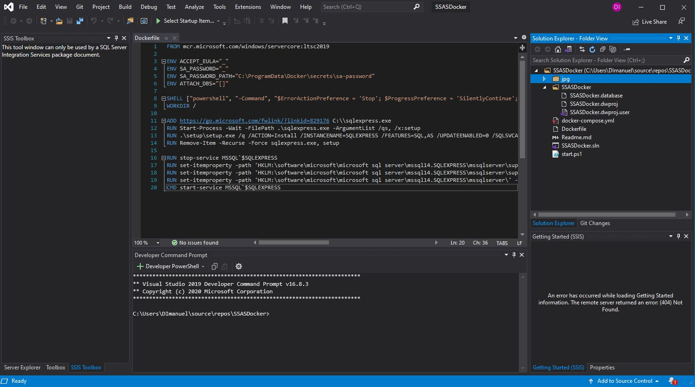
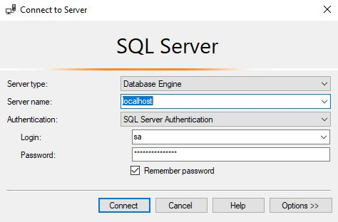
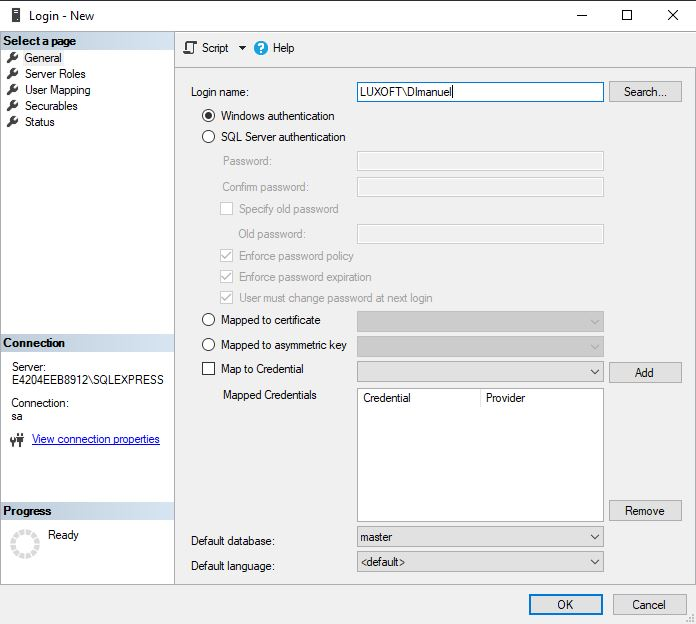
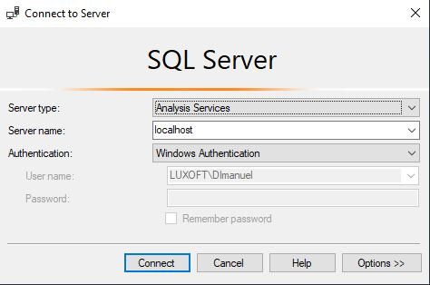

# SSAS Docker
by Denny Imanuel

This mini project showcase how to spin up Microsoft SQL Server container with SSAS (SQL Server Analytics Service) features. 
This also shows how to build SSAS project via SSDT (SQL Server Data Tools) tools in Visual Studio

### Requirement
1. Visual Studio CE - Install Visual Studio Community Edition
2. SSDT - Install SSDT (SQL Server Data Tools) tools on Visual Studio (Tools > Get Tools and Features)
3. SSAS - Install SSAS (Microsoft Analytics Services) extension on Visual Studio (Extension > Manage Extension)
4. SSMS - Install SSMS (SQL Server Management Studio) on your Windows machine to connect to Docker Sql
5. Docker Desktop - Install Docker Desktop for Windows on your Windows machine

### SSAS Container

To spin up SSAS container right click Docker Desktop tray icon to show pop up menu and select "Switch to Windows Container". 
And then on Visual Studio terminal (View > Terminal) run Docker Compose command.

> docker-compose up

### SSAS Connection

After container running, first you need to connect to MSSQL Database Engine using SSMS with SQL Authentication

Then add a login user with your Windows Authentication domain\username to allow you to login to SSAS.

After that connect to SSAS Analytic Server using SSMS with Windows Authentication

